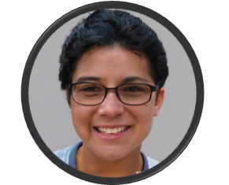

# Especificações do Projeto

A definição exata do problema e os pontos mais relevantes a serem tratados neste projeto foram consolidados com a participação dos usuários em um trabalho de imersão feito pelos membros da equipe a partir da observação dos usuários em seu local natural e por meio de entrevistas. Os detalhes levantados nesse processo foram consolidados na forma de personas e histórias de usuários.

Apresenta-se também os requisitos funcionais e não funcionais, além das restrições do projeto.

## Personas

Desta forma, constatou-se que o presente projeto possui 3 principais personas:

- Vestibulandos (na faixa de idade entre 15 e 18 anos).
- Universitários (na faixa de idade entre 19 e 30 anos )
- Candidatos às vagas de concursos públicos (na faixa de idade de 31 e 50 anos)

A seguir, passamos à análise detalhada das principais personas e suas respectivas histórias de usuários.

| Enzo de Góis                                                                                                                                                                                |                                                                                                                                                                                                                                                    |                                                                                                                                        |
|---------------------------------------------------------------------------------------------------------------------------------------------------------------------------------------------|----------------------------------------------------------------------------------------------------------------------------------------------------------------------------------------------------------------------------------------------------|----------------------------------------------------------------------------------------------------------------------------------------|
|                                                                                                                                                                      | **Idade:** 16  anos - **Ocupação:** Estudante do Ensino Médio Fundamental e vestibulando.                                                                                                                                                          | **Aplicativos**: Instagram,TikTok, Aplicativos de jogos.                                                                                   |
| **Motivações:**  Enzo está cursando o primeiro grau do ensino médio e já se prepara para a prova de vestibular, com foco em odontologia. Sonha em ser dentista cirurgião e ajudar pessoas. | **Frustrações:** Além das matérias regulares da escola, Enzo estuda em um cursinho preparatório. As vezes tem dificuldades para conciliar os estudos da escola e as atividades do cursinho preparatório, que inclui treino para a prova do Enem.   | **Hobbies, História:** Enzo, adora tecnologia e utilizar aplicativos inovadores. Nas horas vagas, gosta de jogar online com os amigos. | 

| Pedro Maia                                                                                                                               |                                                                                                                                                                                                                                                                                                                               |                                                                                                                                                                                                                                                                           |
|------------------------------------------------------------------------------------------------------------------------------------------|-------------------------------------------------------------------------------------------------------------------------------------------------------------------------------------------------------------------------------------------------------------------------------------------------------------------------------|---------------------------------------------------------------------------------------------------------------------------------------------------------------------------------------------------------------------------------------------------------------------------|
|                           | **Idade:** 19  anos - **Ocupação:** Estudante de Medicina.                                                                                                                                                                                                                                                                    | **Aplicativos**: Instagram, Facebook, Linkedin, Aplicativos de bancos e Tinder.                                                                                                                                                                                           |
| **Motivações:**  Pedro sonha em ser médico e poder proporcionar uma vida confortável para seus pais. ................................... | **Frustrações:** Pedro estuda em tempo integral e possui muitas matérias para estudar diariamente. A faculdade demanda muita organização e ele possui dificuldades para administrar o tempo de estudos. O cansaço tem contribuído para perda de foco e queda de sua produtividade. Possui TDHA e perde o foco com frequência. | **Hobbies, História:** Pedro acredita que os estudos podem transformar a vida de qualquer pessoa. Está ansioso para concluir o curso e alcançar sua independência profissional e financeira. Nas horas vagas, gosta de visitar lugares novos, como restaurantes e boates. |
|                                                                                                                                          |                                                                                                                                                                                                                                                                                                                               |                                                                                                                                                                                                                                                                           |

| Isabela Meireles                                                                                                |                                                                                                                                                                                                                                                                           |                                                                                                                                                                                                                                                                              |
|-----------------------------------------------------------------------------------------------------------------|---------------------------------------------------------------------------------------------------------------------------------------------------------------------------------------------------------------------------------------------------------------------------|------------------------------------------------------------------------------------------------------------------------------------------------------------------------------------------------------------------------------------------------------------------------------|
|  | **Idade:** 26  anos - **Ocupação:** Analista oficial do TRT.                                                                                                                                                                                                              | **Aplicativos**: Instagram, Linkedin, Aplicativos de bancos.                                                                                                                                                                                                                 |
| **Motivações:** Ser Promotora de Justiça. ................................................................      | **Frustrações:** Além de trabalhar como oficial de justiça no tribunal regional do trabalho, Isabela estuda para um concurso muito disputado e difícil. Possui apenas 4 horas por dia para se dedicar aos estudos e precisa utilizar esse tempo com eficácia e qualidade. | **Hobbies, História:** Isabela passou em seu primeiro concurso aos 21 anos, para o cargo de analista oficial. Contudo, seu grande sonho é ser Promotora de Justiça e por isso se formou em direito. Seu principal hobbe é assistir séries e filmes de investigação criminal. | 

## Histórias de Usuários

Com base na análise das personas forma identificadas as seguintes histórias de usuários:

| EU COMO... `PERSONA` | QUERO/PRECISO ... `FUNCIONALIDADE`                                                      | PARA ... `MOTIVO/VALOR`          |
|----------------------|-----------------------------------------------------------------------------------------|----------------------------------|
| Vestibulando         | Aprender todas as matérias e concluir as tarefas escolares em tempo hábil.              | Passar no vestibular.            |
| Universitário        | Estudar com mais produtividade e foco.                                                  | Aprovação nas matérias do curso. |
| Concurseira          | Concluir cronograma semanal de estudos e aproveitar o tempo disponível de forma eficaz. | Aprovação em concurso público.   |

## Requisitos

As tabelas que se seguem apresentam os requisitos funcionais e não funcionais que detalham o escopo do projeto.

### Requisitos Funcionais

|ID    | Descrição do Requisito  | Prioridade |
|------|-----------------------------------------|----|
|RF-001| Permitir que o usuário cadastre tarefas | ALTA | 
|RF-002| Emitir um relatório de tarefas no mês   | MÉDIA |

### Requisitos não Funcionais

|ID     | Descrição do Requisito  |Prioridade |
|-------|-------------------------|----|
|RNF-001| O sistema deve ser responsivo para rodar em um dispositivos móvel | MÉDIA | 
|RNF-002| Deve processar requisições do usuário em no máximo 3s |  BAIXA | 

Com base nas Histórias de Usuário, enumere os requisitos da sua solução. Classifique esses requisitos em dois grupos:

- [Requisitos Funcionais
 (RF)](https://pt.wikipedia.org/wiki/Requisito_funcional):
 correspondem a uma funcionalidade que deve estar presente na
  plataforma (ex: cadastro de usuário).
- [Requisitos Não Funcionais
  (RNF)](https://pt.wikipedia.org/wiki/Requisito_n%C3%A3o_funcional):
  correspondem a uma característica técnica, seja de usabilidade,
  desempenho, confiabilidade, segurança ou outro (ex: suporte a
  dispositivos iOS e Android).
Lembre-se que cada requisito deve corresponder à uma e somente uma
característica alvo da sua solução. Além disso, certifique-se de que
todos os aspectos capturados nas Histórias de Usuário foram cobertos.

## Restrições

O projeto está restrito pelos itens apresentados na tabela a seguir.

|ID| Restrição                                             |
|--|-------------------------------------------------------|
|01| O projeto deverá ser entregue até o final do semestre |
|02| Não pode ser desenvolvido um módulo de backend        |

Enumere as restrições à sua solução. Lembre-se de que as restrições geralmente limitam a solução candidata.

> **Links Úteis**:
> - [O que são Requisitos Funcionais e Requisitos Não Funcionais?](https://codificar.com.br/requisitos-funcionais-nao-funcionais/)
> - [O que são requisitos funcionais e requisitos não funcionais?](https://analisederequisitos.com.br/requisitos-funcionais-e-requisitos-nao-funcionais-o-que-sao/)

## Diagrama de Casos de Uso

O diagrama de casos de uso foi funamentado de acordo com os requisitos apresentados no projeto. Um diagrama de caso de uso é usado para descrever graficamente um subconjunto do modelo para simplificar a comunicação. Foi utilizado um modelo para fácil visualizacçäo do projeto como um todo.

